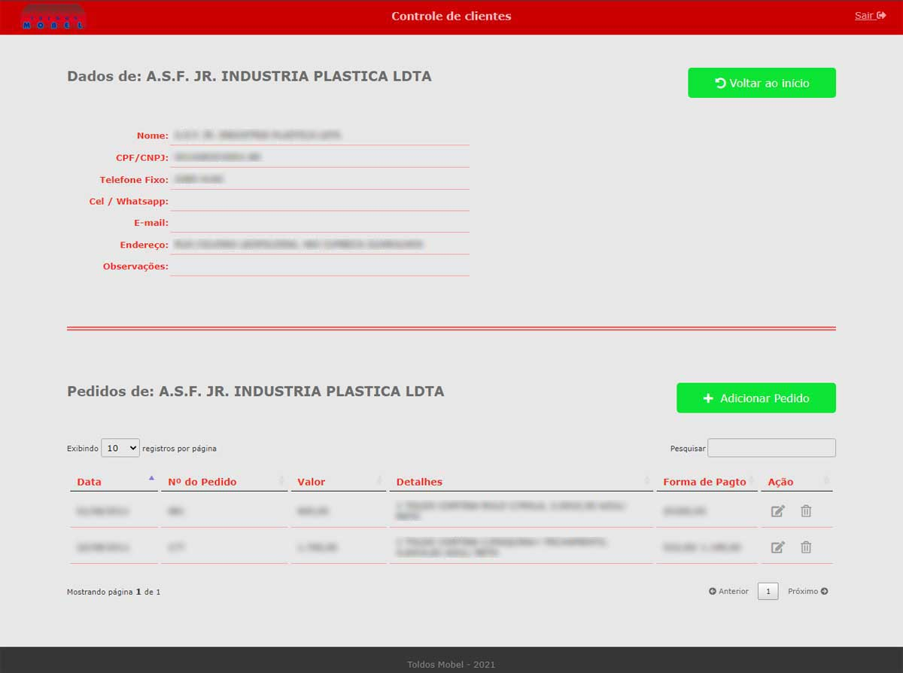

# Customer Management System
Customer Management System

# About
http://clientes.toldosmobel.com.br/

Customer management web system custom-developed for the company Toldos Mobel, in the colors requested by the customer. 
Basically created with php, it allows you to register customers and their orders.

It also allows you to list, edit and delete any entries made in the system. ( Basic CRUD ). 
Uses MySQL database with relationship between "customers" and "orders" tables.

# Layout

Login

Customer list

Add new customer

Only one customer list and their orders

Add new order to specific customer

# Technologies

- HTML5
- CSS3
- Bootstrap
- PHP
- Mysql with relationship between "customers" and "orders" tables

# Author

- Marcelo Paiva

http://codewave.com.br

